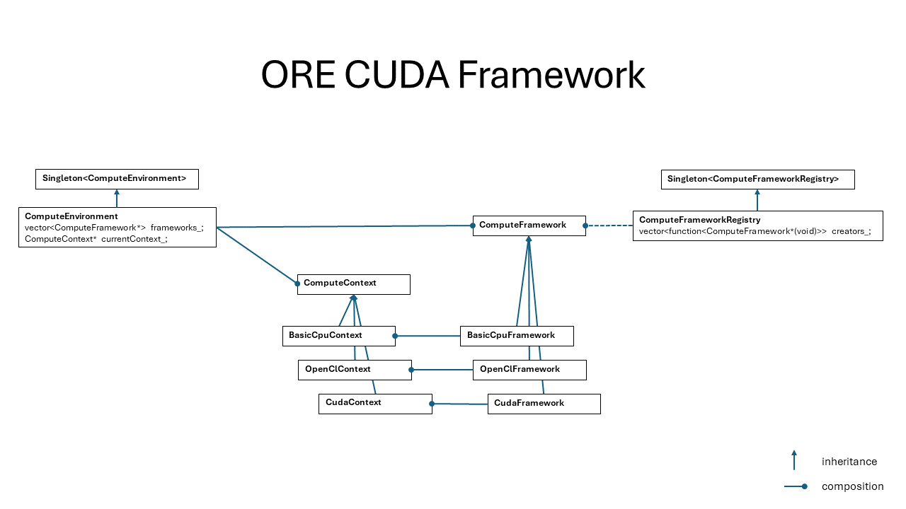

# Building ORE with GPGPU Support on Windows

This tutorial explains how to build ORE with
[GPGPU](https://en.wikipedia.org/wiki/General-purpose_computing_on_graphics_processing_units)
support on Windows.

[Back to tutorials index](../tutorials_index.md)

This build is based upon the vanilla Windows build of ORE:

[Building ORE on Windows](tutorials.010.build_windows.md)

With the differences noted below:

# Build ORE

## Configure ORE

When you run cmake, add the flag `-DORE_ENABLE_OPENCL=ON`:

    cmake .. -DORE_ENABLE_OPENCL=ON

# Run tests

Below are the commands to run the unit tests for the ORE GPGPU Framework:

    cd %ORE_ROOT_DIR%\build\ore\QuantExt\test\Release
    quantext-test-suite.exe --log_level=message --run_test=QuantExtTestSuite/ComputeEnvironmentTest

# Design

Below is a UML Class Diagram for the ORE GPGPU Framework:

